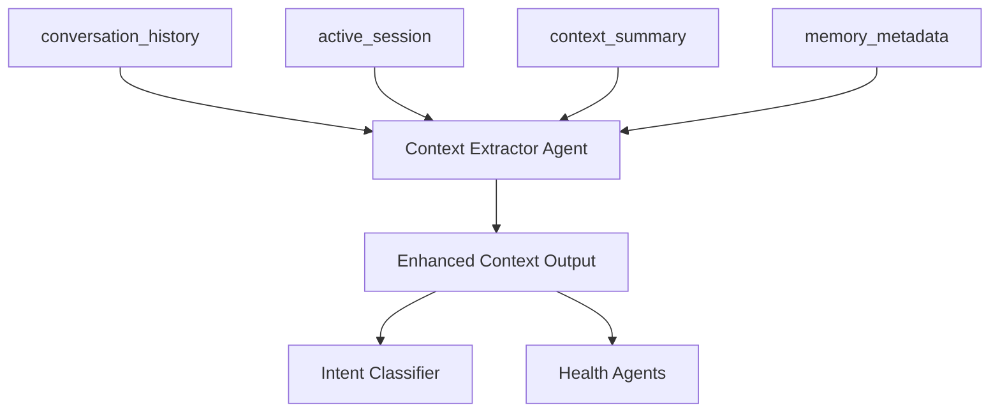

# Memory Block Schema Design
## Sub-Plan 1, Task 1: Memory Architecture Foundation

### 🎯 **Objective**
Define the complete memory block schema for centralized conversation context management using Letta's native memory system.

---

## 📊 **Memory Block Architecture Overview**

### **4 Enhanced Memory Blocks for Context Extractor Agent**



---

## 🏗️ **Memory Block Detailed Schemas**

### **1. conversation_history Block**

**Purpose**: Store complete turn-by-turn conversation with full context
**Format**: Structured JSON
**Limit**: 32,000 characters
**Read-Only**: No (agent can update using core_memory tools)

#### **Schema Structure**:
```json
{
  "session_id": "session_123",
  "turns": [
    {
      "turn_id": 1,
      "timestamp": "2024-01-15T10:30:00Z",
      "user_message": {
        "content": "I am having a headache",
        "message_id": "msg_001"
      },
      "context_enrichment": {
        "previous_context": "No previous context - first message",
        "enriched_message": "User reports having a headache - initial health query",
        "relevant_history": []
      },
      "intent_classification": {
        "intent": "GENERAL_HEALTH",
        "confidence": 0.9,
        "reasoning": "Clear physical health symptom reported"
      },
      "agent_response": {
        "agent_type": "GENERAL_HEALTH",
        "content": "I understand you're experiencing headaches. Can you tell me when they first started and how severe they are on a scale of 1 to 10?",
        "response_id": "resp_001"
      },
      "turn_status": "COMPLETED"
    },
    {
      "turn_id": 2,
      "timestamp": "2024-01-15T10:31:00Z", 
      "user_message": {
        "content": "8",
        "message_id": "msg_002"
      },
      "context_enrichment": {
        "previous_context": "User reported headache, agent asked for severity rating 1-10",
        "enriched_message": "User rates headache severity as 8 out of 10 (severe)",
        "relevant_history": ["turn_1"]
      },
      "intent_classification": {
        "intent": "GENERAL_HEALTH", 
        "confidence": 0.95,
        "reasoning": "Follow-up response to severity question about headache"
      },
      "agent_response": {
        "agent_type": "GENERAL_HEALTH",
        "content": "A severity of 8 indicates a significant headache. How long have you been experiencing this level of pain?",
        "response_id": "resp_002"
      },
      "turn_status": "COMPLETED"
    }
  ],
  "total_turns": 2,
  "last_updated": "2024-01-15T10:31:30Z"
}
```

#### **Memory Management Strategy**:
- **New Turn Addition**: Append to `turns` array
- **Size Management**: Keep last 15-20 turns in active memory
- **Archival Trigger**: When approaching 28,000 characters, archive older turns
- **Context Preservation**: Always keep last 3 turns for immediate context

---

### **2. active_session Block**

**Purpose**: Track current session state and metadata
**Format**: JSON
**Limit**: 4,000 characters  
**Read-Only**: No

#### **Schema Structure**:
```json
{
  "session_info": {
    "session_id": "session_123",
    "user_id": "user_456", 
    "start_time": "2024-01-15T10:30:00Z",
    "last_activity": "2024-01-15T10:31:30Z",
    "status": "ACTIVE"
  },
  "conversation_state": {
    "current_turn": 2,
    "active_topic": "headache_severity_assessment",
    "last_agent": "GENERAL_HEALTH",
    "conversation_phase": "symptom_evaluation",
    "topic_transitions": [
      {
        "turn": 1,
        "topic": "initial_health_complaint",
        "trigger": "new_session"
      },
      {
        "turn": 2, 
        "topic": "headache_severity_assessment",
        "trigger": "severity_inquiry"
      }
    ]
  },
  "agent_context": {
    "primary_agent": "GENERAL_HEALTH",
    "agent_confidence": 0.95,
    "routing_history": ["GENERAL_HEALTH", "GENERAL_HEALTH"],
    "last_intent": "GENERAL_HEALTH"
  },
  "session_metadata": {
    "total_exchanges": 2,
    "average_response_time": 1.2,
    "context_quality_score": 0.9,
    "memory_usage_percent": 25
  }
}
```

---

### **3. context_summary Block**

**Purpose**: Human-readable conversation summary for quick context access
**Format**: Structured Text (Human-readable)
**Limit**: 8,000 characters
**Read-Only**: No

#### **Schema Structure**:
```text
=== CONVERSATION SUMMARY ===
Session: session_123 | User: user_456 | Started: 2024-01-15T10:30:00Z

CURRENT TOPIC: Headache Severity Assessment
ACTIVE AGENT: General Health Agent
CONVERSATION PHASE: Symptom Evaluation

--- CONVERSATION FLOW ---
Turn 1 (10:30): User reported having a headache
→ Routed to General Health Agent (confidence: 0.9)
→ Agent asked for onset time and severity rating (1-10)

Turn 2 (10:31): User rated severity as "8" (severe level)
→ Continued with General Health Agent (confidence: 0.95) 
→ Agent inquired about pain duration at this severity level

--- KEY CONTEXT POINTS ---
• Primary Concern: Headache with severity rating of 8/10
• Symptom Onset: Not yet determined (pending user response)
• Pain Duration: Not yet determined (current inquiry)
• Previous Medical History: Not discussed yet
• Current Medications: Not discussed yet

--- NEXT LIKELY TOPICS ---
• Duration of current severe pain level
• Associated symptoms (nausea, vision changes, etc.)
• Potential triggers or onset circumstances
• Previous headache patterns/history

--- CONVERSATION QUALITY ---
Context Continuity: Excellent (95%)
Intent Classification: Accurate (100% correct routing)
Agent Specialization: Appropriate (health symptoms)
User Engagement: Active (responding to all questions)
```

---

### **4. memory_metadata Block**

**Purpose**: Memory management metadata and system information
**Format**: JSON
**Limit**: 2,000 characters
**Read-Only**: No

#### **Schema Structure**:
```json
{
  "memory_usage": {
    "conversation_history": {
      "current_size": 8500,
      "limit": 32000,
      "utilization_percent": 26.6,
      "turns_stored": 2,
      "last_cleanup": null
    },
    "active_session": {
      "current_size": 1200,
      "limit": 4000,
      "utilization_percent": 30.0
    },
    "context_summary": {
      "current_size": 2100,
      "limit": 8000,
      "utilization_percent": 26.3
    }
  },
  "archival_info": {
    "total_archived_turns": 0,
    "last_archival": null,
    "archival_trigger_threshold": 28000,
    "next_archival_estimate": null
  },
  "performance_metrics": {
    "avg_context_generation_time": 0.8,
    "memory_update_success_rate": 100.0,
    "context_accuracy_score": 0.95,
    "last_performance_check": "2024-01-15T10:31:30Z"
  },
  "system_flags": {
    "memory_rotation_enabled": true,
    "archival_ready": true,
    "context_validation_enabled": true,
    "emergency_mode": false
  }
}
```

---

## 🔧 **Data Format Decision Matrix**

### **Format Analysis**

| Memory Block | Chosen Format | Reasoning |
|--------------|---------------|-----------|
| `conversation_history` | **Structured JSON** | Complex nested data, easy parsing, structured updates |
| `active_session` | **JSON** | Dynamic metadata, frequent updates, structured queries |
| `context_summary` | **Structured Text** | Human-readable, natural language context, agent-friendly |
| `memory_metadata` | **JSON** | System metrics, numerical data, structured analysis |

### **JSON vs Structured Text Trade-offs**

**JSON Advantages:**
- ✅ Structured data access
- ✅ Easy programmatic updates  
- ✅ Nested data support
- ✅ Type safety

**Structured Text Advantages:**
- ✅ Human-readable
- ✅ Natural language processing friendly
- ✅ Flexible format
- ✅ Agent prompt integration

**Decision:** Hybrid approach using both formats based on use case.

---

## 📏 **Memory Size Calculations**

### **Typical Conversation Memory Usage**

| Scenario | Turns | JSON Size (chars) | Text Size (chars) | Total Usage |
|----------|-------|-------------------|-------------------|-------------|
| Short Chat | 3-5 turns | ~4,000 | ~1,500 | ~5,500 |
| Medium Chat | 8-12 turns | ~12,000 | ~3,500 | ~15,500 |
| Long Chat | 15-20 turns | ~25,000 | ~6,000 | ~31,000 |
| **Limit Threshold** | **~18 turns** | **~28,000** | **~7,000** | **~35,000** |

### **Memory Rotation Strategy**

```text
Memory Usage Thresholds:
- 0-70%: Normal operation, keep all turns
- 70-85%: Warning level, prepare for rotation  
- 85-95%: Start archiving older turns (keep last 5)
- 95%+: Emergency rotation (keep last 3 turns)
```

---

## 🔄 **Schema Evolution Strategy**

### **Version 1.0 (Current)**
- Basic turn tracking
- Simple context enrichment
- Manual memory management

### **Future Enhancements (v1.1+)**
- Automatic topic detection
- Sentiment tracking
- Multi-session continuity
- Advanced context scoring

### **Schema Flexibility**
- **Backward Compatible**: New fields added, never removed
- **Optional Fields**: New features don't break existing data
- **Migration Path**: Clear upgrade strategy for schema changes

---

## ✅ **Schema Validation Rules**

### **conversation_history Validation**
- `turns` array must be chronologically ordered
- Each turn must have `turn_id`, `timestamp`, `user_message`
- `turn_status` must be "PENDING", "IN_PROGRESS", or "COMPLETED"
- Maximum 25 turns in active memory

### **active_session Validation**
- `session_id` must match conversation_history
- `current_turn` must match latest turn in conversation_history
- `status` must be "ACTIVE", "PAUSED", or "ENDED"
- All timestamps must be valid ISO format

### **Data Consistency Rules**
- Turn IDs must be sequential and unique
- Agent responses must reference valid agent types
- Memory usage calculations must be accurate
- Session metadata must stay synchronized

---

## 🎯 **Implementation Readiness**

### **Schema Status**: ✅ **COMPLETE**
- All memory blocks defined
- Data formats decided
- Size limits calculated
- Validation rules established

### **Next Steps**:
1. ✅ Schema design complete
2. 🔄 **Next**: Update `UserIdentityService.createContextCoordinatorAgent()`
3. 🔄 **Next**: Create memory update utility methods
4. 🔄 **Next**: Update context extractor prompt

---

*This schema provides the foundation for centralized context management, solving the conversation continuity problem through structured memory blocks and complete turn tracking.* 